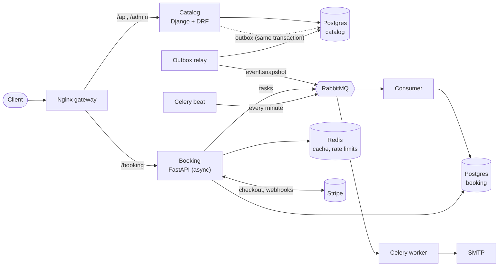

# TicketHub

[](https://github.com/astriddominguez/TicketHub/actions/workflows/ci.yml)

An event-ticketing backend built as **two services** that talk through
**events**, designed around the problem every ticketing site has: when
hundreds of people try to buy the last tickets at the same time, **never sell
the same ticket twice**.

- **Catalog** (Django + DRF): organizers manage venues, events and prices.
- **Booking** (FastAPI, async): buyers hold tickets for 10 minutes, pay with
  Stripe and receive their tickets with QR codes by email.

Under a load test with 300 concurrent users fighting for 50 front-row tickets,
**exactly 50 were sold** ([results](loadtests/RESULTS.md)).

---

## Architecture



| Process | What it does |
|---|---|
| `catalog` | Public catalog API (filters, search, pagination), organizer API, Django admin, JWT login |
| `catalog-relay` | Publishes the outbox to RabbitMQ (transactional outbox pattern) |
| `booking` | Availability, reservations, Stripe checkout and webhooks |
| `booking-consumer` | Applies the catalog's event snapshots to the booking inventory |
| `booking-worker` / `booking-beat` | Expire unpaid reservations, send emails with QR tickets, refunds |

Each service owns its database: no shared tables. They share only a JWT signing
key and the message contract.

---

## Key technical decisions

### No double selling: one atomic conditional `UPDATE`
The obvious code (read stock → check → subtract → save) has a race: two buyers
read "1 left", both pass the check, both "buy". Reserving is instead a single
statement:

```sql
UPDATE inventory SET available = available - :qty
WHERE id = :id AND on_sale AND available >= :qty
RETURNING price
```

Postgres locks the row while it runs, so the check and the write can't be
separated. A `CHECK (available >= 0)` constraint is the safety net. The same
"change it only if it's still in the state I expect" pattern guards cancelling
and expiring, so tickets are released exactly once even when both race.

Considered and rejected: `SELECT … FOR UPDATE` (correct, but two round trips),
a Redis lock (another moving part, when the data already lives in a database
that can lock), optimistic locking (in a rush everyone collides and retries).

Proof: [`test_concurrency.py`](services/booking/tests/test_concurrency.py) fires
50 concurrent requests at 10 tickets (exactly 10 succeed), and a deliberately
naive version in the same file **does** oversell, showing the bug it prevents.

### Django for the catalog, FastAPI for booking
The catalog is CRUD with an admin panel and permissions: Django's admin, ORM
and DRF give that almost for free. Booking is the hot path in a ticket rush:
many concurrent requests mostly waiting on Postgres and Redis, where async
FastAPI with SQLAlchemy 2.0 and asyncpg shines, with Pydantic contracts.

### Services talk through events, not HTTP calls
When an organizer publishes or changes an event, booking must know. A
synchronous call would couple the two: if booking were down, publishing would
fail. Instead the catalog emits an event and booking catches up when it can.

- **Transactional outbox:** the change and its message are written in the same
  database transaction; a relay publishes them later. No "saved but never
  announced" gap, and messages wait safely if RabbitMQ is down.
- **Snapshots with versions:** each message is the event's full current state
  plus a version. Booking ignores anything not newer than what it has, so
  duplicates and out-of-order delivery are harmless (at-least-once delivery).
- **Dead-letter queue:** invalid messages go aside for inspection instead of
  blocking the queue.

### Payments that can't be lost or doubled
- Webhooks are trusted only with a valid **Stripe signature**, and each Stripe
  event id is recorded in the same transaction as its effect: **idempotent**.
- A Checkout page lives 30 minutes but a reservation only 10. A **late payment**
  isn't confirmed (the tickets may be gone): it's recorded and **refunded**.
- The database records facts ("paid at", "tickets sent at"); Celery acts on
  them, and a periodic **sweep** retries anything a lost task left undone.
- Cancelling an event refunds every paid reservation through the same sweep.

### Fail open where it's safe
Redis provides the availability cache and the rate limits. If Redis is down,
requests go through to Postgres: Redis protects and accelerates, but
correctness comes from Postgres. The cached availability may lag up to 5 s; it's
only for display, never for selling.

### Security details worth mentioning
- JWT (access 15 min, refresh 1 day) carries roles, so booking authorizes
  without calling the catalog. The token's `alg` is pinned (no `alg: none`).
- Drafts and other users' resources return **404, not 403**: no leaking what exists.
- Login is throttled per client IP. Behind the gateway, Nginx **overwrites**
  `X-Forwarded-For`, so clients can't spoof their IP to dodge the limit.
- QR ticket codes are HMAC-signed, verifiable at the door without a database.
- Images run as a non-root numeric UID; secrets never enter images or git, and
  Terraform passes them as write-only values (not kept in its state).

---

## Observability

| | Tool | What you get |
|---|---|---|
| Logs | structlog | JSON lines with `request_id`, `user_id`, `trace_id` |
| Traces | OpenTelemetry → Jaeger | One trace from the catalog request, through the outbox and RabbitMQ, to the booking consumer |
| Metrics | Prometheus → Grafana | RPS, p95 latency, 5xx rate, reservations by outcome, outbox lag (provisioned dashboard) |

The trace context is stored in the outbox row, so a trace survives the gap
between the request and the relay publishing it seconds later.

---

## Load test

300 concurrent users for 60 s on a laptop, everything running on the same
machine. Full details in [loadtests/RESULTS.md](loadtests/RESULTS.md).

| Requests | Throughput | p50 | p95 | Errors | Oversold |
|---:|---:|---:|---:|---:|---:|
| 10,149 | ~170 req/s | 12 ms | 90 ms | 0.01% | **0** |

The load test found a real problem: FastAPI's built-in telemetry was exporting
every span a second time; disabling it **halved the p95 (170 → 90 ms)**.

---

## Run it

Requirements: Docker. For development also [uv](https://docs.astral.sh/uv/).
Start with `cp .env.example .env` and fill in the values (Stripe keys are
optional: without them the payment endpoints answer `503`).

### Everything in containers (one command)
```bash
docker compose up -d --build        # or: make stack
```
| URL | |
|---|---|
| http://localhost:8080/api/docs/ | Catalog API (Swagger) |
| http://localhost:8080/booking/docs | Booking API (Swagger) |
| http://localhost:8080/admin/ | Django admin |
| http://localhost:3000 | Grafana dashboard |
| http://localhost:16686 | Jaeger traces |
| http://localhost:8025 | Captured emails (Mailpit) |

### On Kubernetes (local cluster, managed by Terraform)
Needs kind, kubectl, Helm and Terraform.
```bash
make tf-init && make tf-apply       # 3-node kind cluster + Helm release
# -> http://localhost:8090
make tf-destroy
```
The Helm chart ([infra/k8s/charts/tickethub](infra/k8s/charts/tickethub))
runs 2 replicas of each API, migration Jobs, readiness/liveness probes and the
in-cluster infrastructure (switchable off to use managed services).

### Development (services on your machine)
```bash
make install        # dependencies (uv workspace)
make up             # infrastructure only
make migrate && make booking-migrate
make run            # catalog  :8000
make run-booking    # booking  :8001
make relay          # + consumer, worker, beat: see `make help`
```

### Tests and quality
```bash
make test           # 151 tests against real Postgres, Redis and RabbitMQ
make lint           # ruff + mypy (strict on the booking service)
make loadtest       # Locust ticket rush + oversell check
```
CI (GitHub Actions) runs lint, types, Helm and Terraform validation, the tests
with an 80% coverage floor (catalog 84%, booking 94%), and builds the images.

---

## Deployment status

TicketHub is deployed to **Kubernetes on a local kind cluster**, with the
infrastructure defined in Terraform. It is **not published on a public cloud**,
to avoid costs; the chart's `infra.enabled=false` switch and the Terraform
layout are where a cloud deployment (managed Postgres, Redis, RabbitMQ) would
plug in.

---

## Tech stack

| Area | Tools |
|---|---|
| Language & deps | Python 3.12, uv (workspace monorepo) |
| Services | Django 6 + DRF, FastAPI + Pydantic v2 |
| Data | PostgreSQL ×2, SQLAlchemy 2.0 async + Alembic, Django ORM |
| Messaging & jobs | RabbitMQ (aio-pika, pika), Celery + Beat |
| Cache & limits | Redis |
| Payments | Stripe (test mode) |
| Auth | JWT (simplejwt / PyJWT), roles |
| Observability | structlog, OpenTelemetry, Jaeger, Prometheus, Grafana |
| Testing | pytest, pytest-asyncio, factory-boy, Locust |
| Quality | ruff, mypy, pre-commit, GitHub Actions |
| Delivery | Docker multi-stage, Nginx, Kubernetes (kind), Helm, Terraform |

## Repository layout

```
services/
  catalog/      Django: events, accounts, messaging (outbox), tests
  booking/      FastAPI: reservations, payments, consumer, Celery tasks, tests
infra/
  nginx/        gateway config (shared by compose and Kubernetes)
  k8s/          kind config and the Helm chart
  terraform/    local cluster + release as code
  prometheus/, grafana/   scrape config and provisioned dashboard
loadtests/      Locust scenario, seed/oversell check, results
```

## Possible improvements

- **Ticket check-in:** codes are signed, but a copied valid code isn't
  rejected yet; that needs a "ticket already used" record.
- **Login lockout per account,** not only per IP (balanced against attackers
  locking other people out).
- **Sliding-window or token-bucket rate limiting** (fixed windows allow short
  bursts at window edges).
- **Asymmetric JWT (RS256):** booking would verify with a public key it can't
  sign with.
- **Celery worker metrics** (Prometheus multiprocess mode) and Prometheus inside
  the Kubernetes cluster.
- **Cloud deployment** with managed Postgres, Redis and RabbitMQ.
- **Numbered seats** instead of general admission per zone.
